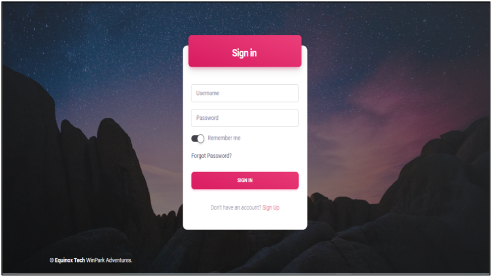
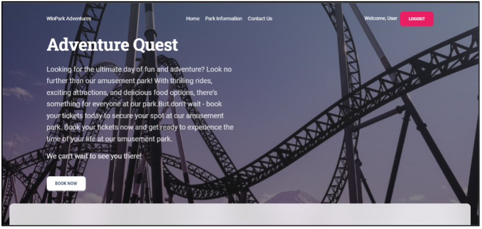
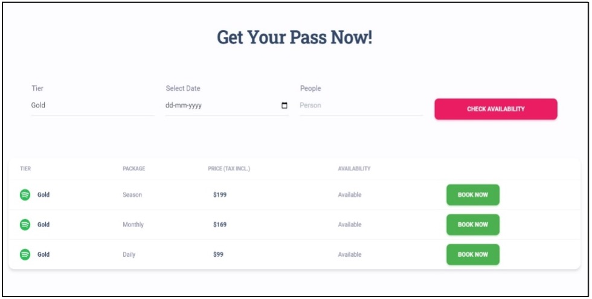
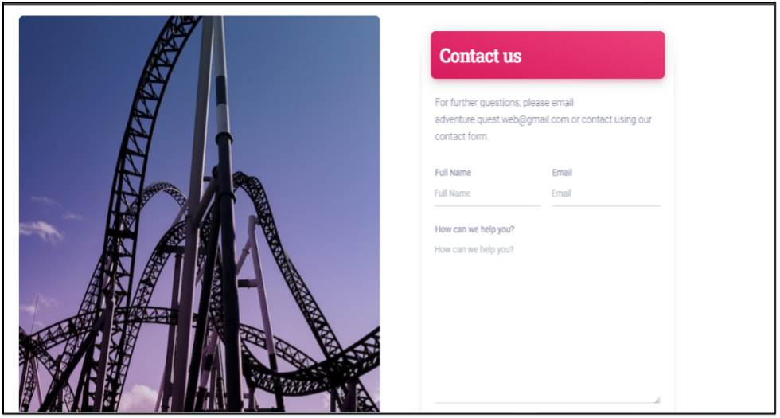
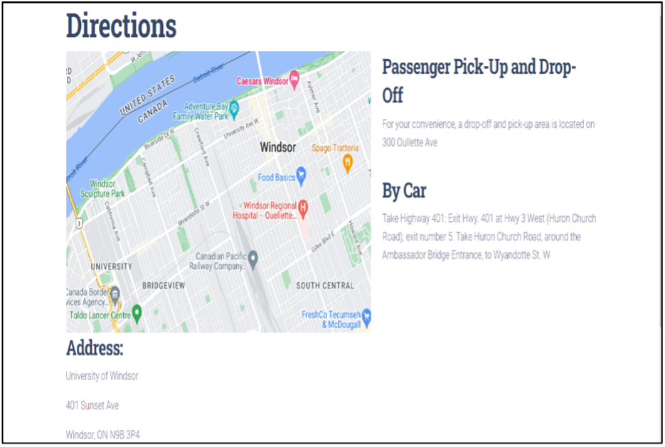

# Adventure-Quest...
Amusement Park Booking Website with Django and Python. This application is built as a part of our course Internet Applications.

### SignIn screen & HomePage




### Ticket Booking



### ContactUs & AboutPage



### Location Information



## Features
- [x] Signup with user verification
- [x] User authentication and login with email and password
- [x] Information page (Park timings & other relevant information)
- [x] A page for upcoming offers and discounts
- [x] Live location feature to show/direct to the park's location
- [x] Allowing booking for multiple tiers passes which could include daily, monthly or yearly passes for full or partial access to different rides and adventure activities.

## Getting Started

### Setting up project

- Fork the repository
- Clone repository (If forked, can use the forked repo link)
```commandline
$ git clone https://github.com/DhruvPatel96/adventure_quest
$ cd AdventureQuestWeb
```
- Module installation
```commandline
$ virtualenv env
$ source env/bin/activate
$ pip install -r requirements.txt
```
- Database setup
```commandline
$ python manage.py makemigrations
$ python manage.py migrate
```
- Create superuser
```commandline
$ python manage.py createsuperuser
```
- Start the application
```commandline
$ python manage.py runserver
```

* AppSeed Material Kit Design is used as the base for the project. Thanks for providing a wonderful platform!
